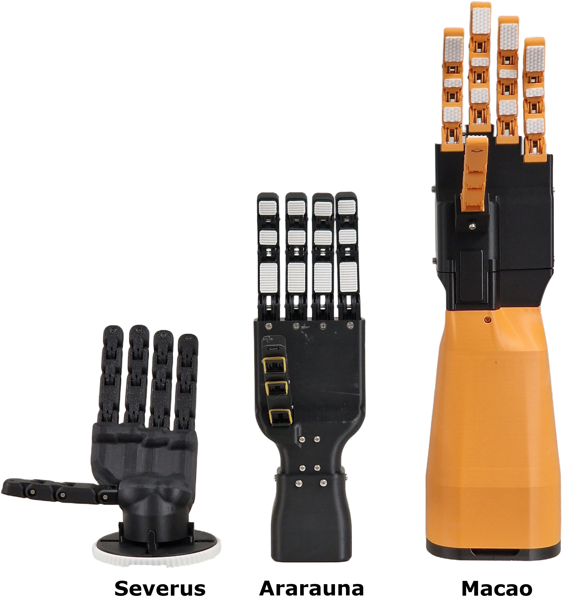
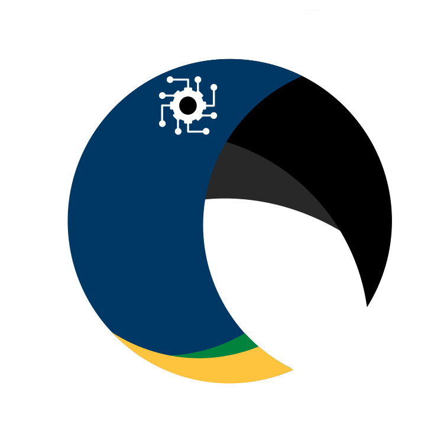

*Title:*

**Open-Source Prosthetic Hands for Community Use and STEM Education**

*Authors:*

[Rudy De-Xin de Lange](https://orcid.org/0009-0008-2099-0941), Andrew Japes, [Lucas Ferrari Gerez](https://orcid.org/0000-0002-2997-4672)

*Abstract:*

Prosthetic technologies restore function and independence of millions of individuals worldwide with limb loss and, at the same time, exemplify the complex challenges inherent to human-centred engineering and design. Meanwhile, in the United Kingdom (UK), only a small portion of secondary education students choose to pursue a career in Science, Technology, Engineering and Mathematics (STEM) fields. This creates a large discrepancy between the supply and demand of individuals to fulfil engineering and technology positions. To tackle both challenges, we propose the Ararauna, Macao and Severus open-source, affordable prosthetic hands that range from basic to advanced designs. They are intended 1) for individuals with upper limb differences and 2) as tools to assist in teaching and promoting STEM-related skills in UK secondary education.  We conducted three experiments looking into grasping capabilities, grip strength, and durability. Our results demonstrate that all three hands are suitable for use as an assistive wearable device or as an educational tool. Our work aims to encourage the prosthetic community to provide the general public with more affordable open-source medical devices intended for individual and educational use. Future work focuses on integrating the presented hands within UK secondary school curricula.

*Repository Contents:*

* .STL (individual parts)  & .STEP (assembly) files for the Ararauna, Macao, and Severus prosthetic hands.
* Some (example) code for programming each hand respectively.
* A Bill of Materials (BOM) for each hand.

*The Prosthetic Hands:*

*Video:*

In the [following video](https://youtu.be/XQv565ON-JM) the capabilities of the three proposed prosthetic hands (Ararauna, Macao, Severus) and two of the three different conducted experiments (Real-world Object Grasping and Grasp Durability) are shown, in that order respectively.

  

*Contact:*

For more information, please visit [our website](https://www.araralab.uk/home). Alternatively, please contact the [main author](mailto:3063568D@student.gla.ac.uk) or the [academic supervisor](mailto:Lucas.FerrariGerez@glasgow.ac.uk).

 